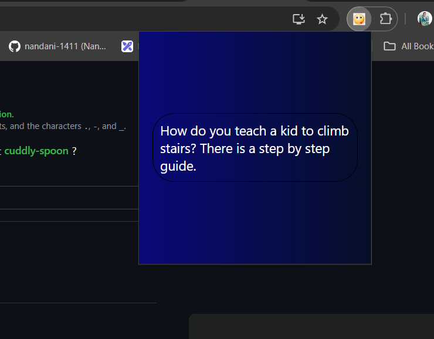

# Get Jokes Chrome Extension

## 📖 Description
Get Jokes is a Chrome extension that fetches a unique joke every time you click it. Whether you're looking for a quick laugh or a moment of levity, this extension delivers!

---

## 🚀 Features
<ul>
  <li>Fetches a unique joke from an API every time.</li>
  <li>Simple and lightweight extension.</li>
  <li>Works seamlessly in the background.</li>
</ul>

---

## 🖼️ Screenshots

<h3>Extension</h3>

<h3>Joke Example</h3>

---

## 🛠️ Installation

<ol>
  <li>Clone or download this repository:
    <pre><code>git clone https://github.com/nandani-1411/Chrome-Extension.git</code></pre>
  </li>
</ol>
